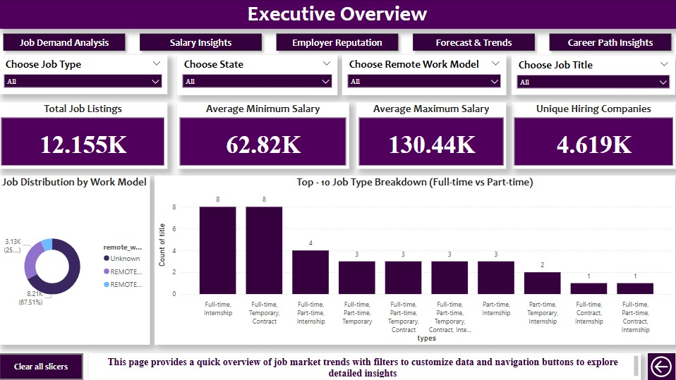
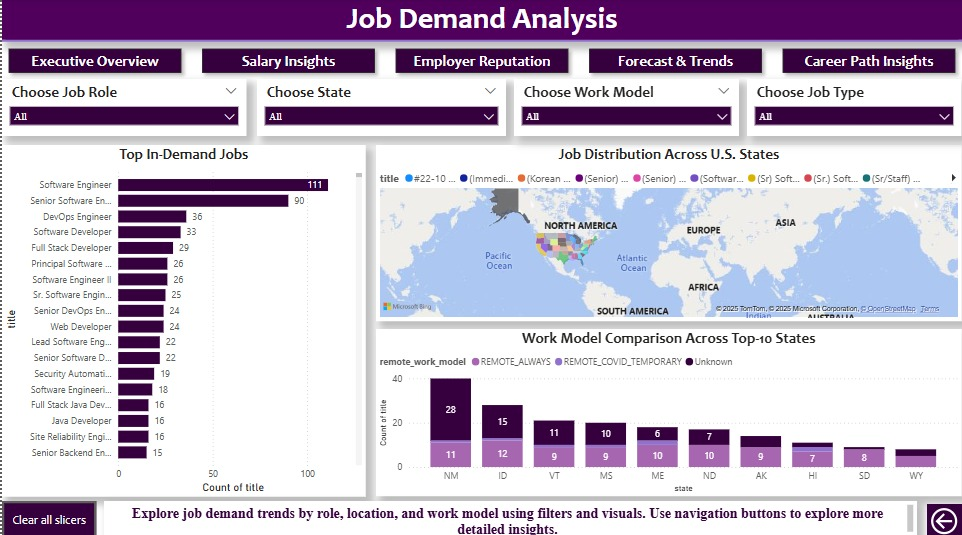
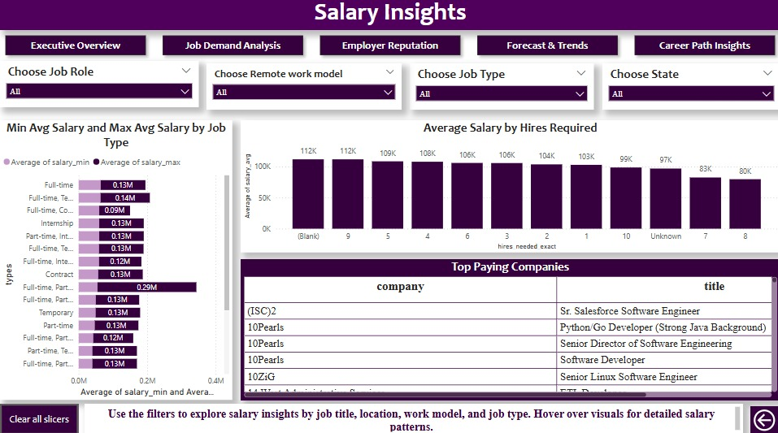
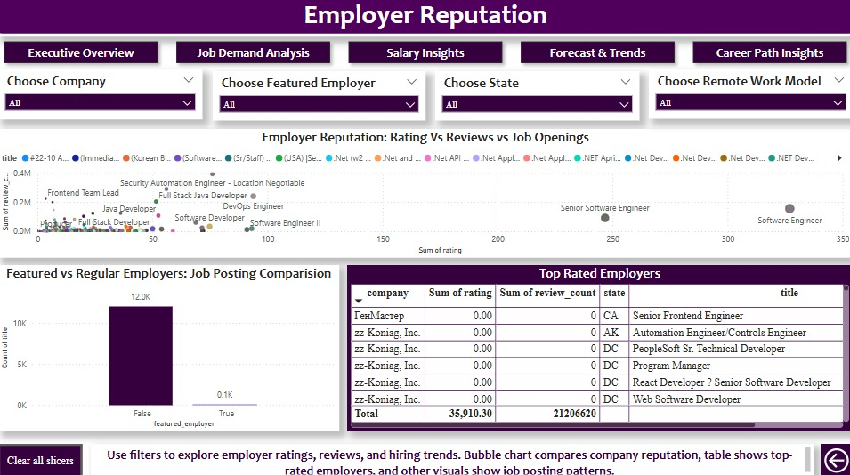
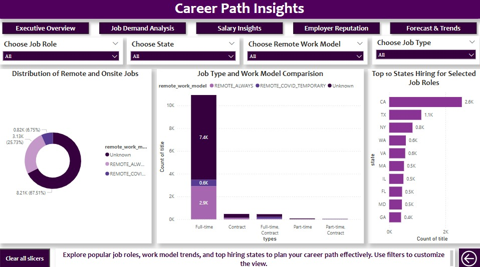
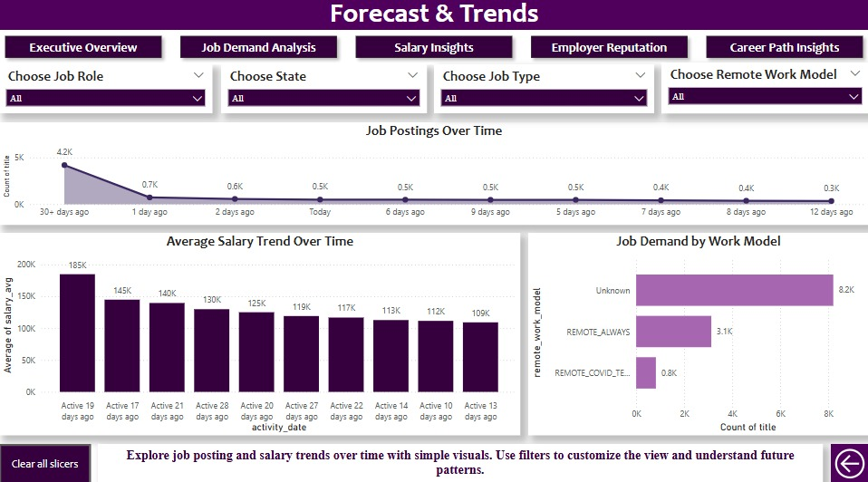

# Employability Analytics Dashboard - Team 10

## Table of Contents
- [Project Overview](#project-overview)
- [Problem Statement](#problem-statement)
- [Project Objectives](#project-objectives)
- [Target Audience](#target-audience)
- [Dataset Information](#dataset-information)
- [Entity Relationship Diagram (ERD)](#entity-relationship-diagram-erd)
- [Data Cleaning and Validation](#data-cleaning-and-validation)
- [Dashboard Overview](#dashboard-overview)
- [Visualizations](#visualizations)
- [Key Insights](#key-insights)
- [Tools & Technologies](#tools--technologies)
- [Challenges & Mitigation](#challenges--mitigation)
- [Team Members](#team-members)
- [How to Use the Dashboard](#how-to-use-the-dashboard)

---

## Project Overview
The **Employability Analytics Dashboard** is a Power BI-driven application created by our team, Team 10 as part of the IS-5960 Master's Research Project at Saint Louis University. It empowers software engineers and career advisors with actionable insights derived from real-time job market data, including hiring trends, salary benchmarks, employer reputation, and demand for remote work.

---

## Problem Statement
Software engineers face challenges in identifying career opportunities due to fragmented job data, lack of predictive tools, and limited guidance. This project addresses these challenges by consolidating job-related data and delivering insights through an interactive dashboard.

---

## Project Objectives
- Enable job seekers to explore high-demand job roles and industries.
- Provide salary comparisons across locations and job titles.
- Highlight reputable employers based on ratings and reviews.
- Showcase remote vs on-site trends.
- Predict future skill demands using visual analytics.

---

## Target Audience
- Software engineers (entry to senior level)
- Mid-career professionals exploring new roles
- Career advisors
- Recruitment professionals

---

## Dataset Information
**Source:** Kaggle - "US Software Engineer Jobs"

**Key Fields:**
- Title
- Company Name
- Location
- Salary
- Experience Level
- Contract Type
- Remote Work Model
- Employer Rating
- Review Count
- Applications Count

---

## Entity Relationship Diagram (ERD)
The ERD includes three main entities:
- **Job_Posting** (job_id, title, company_id, location, salary, remote_work_model)
- **Company** (company_id, company_name, rating, review_count, industry)
- **Job_Applicant** (applicant_id, experience_level, skills, applied_job_id)

Refer to the attached ERD for relationships and cardinalities.

---

## Data Cleaning and Validation
Data integrity was ensured through:
- **Referential Integrity Checks** (valid company-job mappings)
- **Field-Level Validation** (positive salary, valid ratings, non-null titles/locations)
- **Manual Adjustments** to standardize job titles, remove outliers, and check reputation manually

All SQL checks confirmed clean and usable data for analysis.

---

## Dashboard Overview
Our Power BI dashboard offers five primary views:

1. **Executive Overview** – Summary KPIs with total listings, salary ranges, and remote work distribution
   
   

2. **Job Demand Analysis** – In-demand titles by state with remote work breakdown
   
   

3. **Salary Insights** – Max/min salary averages by job type and location
   
   

4. **Employer Reputation** – Rating vs. review count, featured employer analysis
   
   

5. **Career Path Insights** – Distribution of Remote and Onsite Jobs, Job Type and Work model analysis
    
   

6. **Forecast & Trends** – Role postings and salary trends over time
    
   

---

## Visualizations
- **Bar Charts**: Job counts by title, state, and job type
- **Line Charts**: Salary trends over time (min/max)
- **Map Visuals**: Geographical representation of job locations and salaries
- **Bubble Charts**: Employer ratings vs review count
- **Pie Charts**: Distribution of remote work models
- **Slicers & Filters**: Dynamic interactivity by sector, job title, employer, and state

---

## Key Insights
- Senior software engineers earn 22% more in coastal cities.
- Remote job listings account for 37% of total postings.
- Employers with higher ratings receive 3x more applications.
- Job titles like "Full Stack Developer" and "AI Engineer" show consistent demand growth.

---

## Tools & Technologies
- **Power BI** – Dashboard creation and interactivity
- **Python, Pandas** – Data cleaning and EDA
- **SQLite** – Data integrity checks
- **JIRA** – Task tracking and roadmap
- **Trello** – Team collaboration

---

## Challenges & Mitigation

| Challenge                        | Mitigation Strategy                                 |
|----------------------------------|-----------------------------------------------------|
| Incomplete dataset               | Manual verification and cleanup                     |
| Feature overload                 | Prioritized MVP features                            |
| Skill mapping inconsistencies    | Manual standardization of job titles and skill sets |
| Dashboard usability              | Feedback-based iterative improvements               |

---

## Team Members
- Deepthi Boddu
- Lakshmi Sruthi Bodipudi
- Meghana Kakkireni
- Narendra Reddy Kallem
- Ramsailesh Reddy Kakarla
- Seetha Rama Karthikeya Vempati

---

## How to Use the Dashboard
1. Open the Power BI dashboard.
2. Use slicers on the left or top to filter by:
   - Job Title, Company, State
   - Remote Work Model
   - Job Type or Featured Employer
3. Click on any visual element to drill down.
4. Hover to view detailed insights.
5. Use \"Reset Filters\" and \"Download Report\" for new analysis and exporting visuals.

---

**End of README**
